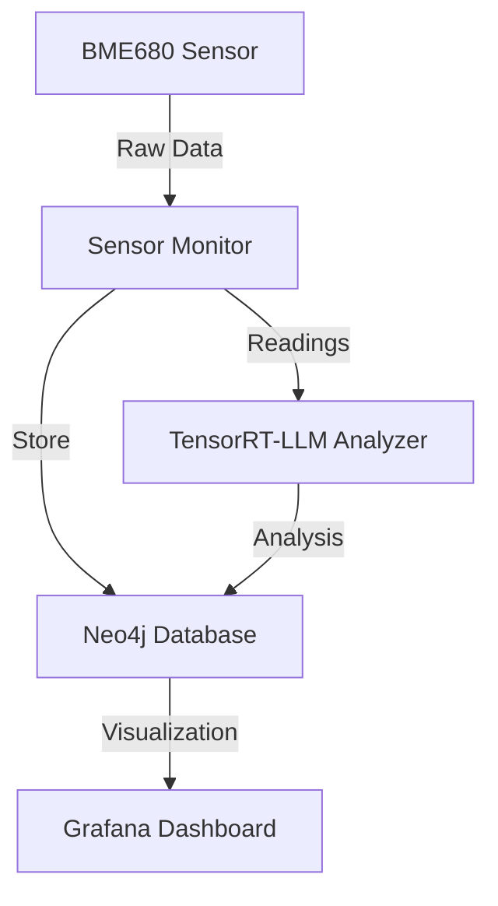

# BME680 Sensor Monitoring with TensorRT-LLM Integration

This project combines BME680 sensor data collection with advanced AI analysis using TensorRT-LLM on NVIDIA Jetson platforms.

## New Features

- Real-time sensor data analysis using TensorRT-LLM
- Historical trend analysis and recommendations
- Automated insights in Grafana dashboard
- Efficient processing optimized for Jetson platforms

## Prerequisites

- NVIDIA Jetson device (Nano, Xavier, or Orin)
- BME680 sensor
- Python 3.8+
- Docker and Docker Compose
- TensorRT-LLM
- Neo4j Database
- Grafana

## Installation

1. Clone the repository:
```bash
git clone https://github.com/yourusername/bme680-jetson-neo4j.git
cd bme680-jetson-neo4j
```

2. Install dependencies:
```bash
pip install -r requirements-enhanced.txt
```

3. Set up TensorRT-LLM:
```bash
# Install TensorRT-LLM
pip install tensorrt-llm

# Download and optimize the model
python scripts/optimize_model.py
```

## Usage

1. Start the monitoring system:
```bash
python src/main_enhanced.py
```

2. Access the Grafana dashboard:
- Open `http://localhost:3000`
- Login with your credentials
- Navigate to the "Environmental Analysis Dashboard"

## Architecture



## Features in Detail

### Real-time Analysis
- Temperature, humidity, pressure, and gas readings analysis
- Immediate environmental condition assessment
- Health impact evaluation

### Historical Trends
- Pattern recognition in sensor data
- Trend analysis and predictions
- Long-term recommendations

### Grafana Integration
- Real-time monitoring dashboard
- AI-powered insights panel
- Historical trend visualization

## Configuration

1. Neo4j Settings (`config/neo4j.conf`):
```yaml
uri: bolt://localhost:7687
user: neo4j
password: your_password
```

2. TensorRT-LLM Settings (`config/tensorrt.conf`):
```yaml
model_path: /path/to/model
max_batch_size: 1
max_sequence_length: 512
```

## Contributing

1. Fork the repository
2. Create your feature branch
3. Commit your changes
4. Push to the branch
5. Create a new Pull Request

## License

MIT

## Original Project Credit

Based on the original work by Collabnix team.